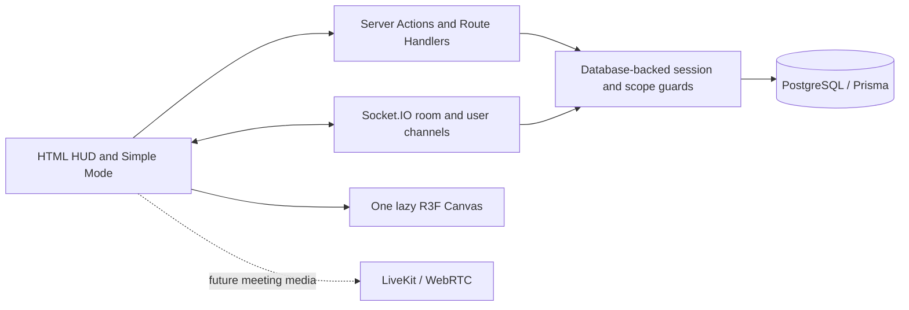

# System Architecture

## System Overview

Existing implementation through Phase 9; reconcile incrementally. See [compatibility audit](compatibility-audit.md) for gaps and validation. Do not re-run the phase prompts as greenfield instructions.

## Frontend

Next.js App Router + React. After check-in, `WorkSessionPanel` owns the full-viewport HUD shell, attendance snapshot and active panel. `PresencePanel` owns the client socket and room snapshot. Normal panels stay HTML overlays over one lazy Canvas. Simple Mode disables WebGL while retaining those controls. Thai is primary with English leaf-key fallback in `src/i18n` and `locales`.

## Backend

`server.ts` hosts Next.js and Socket.IO in one persistent Node process. Use `npm run dev` locally. Production requires `NODE_ENV=production` with `npm start`; plain `next start` does not host Socket.IO. Server Actions own attendance writes; Route Handlers own auth and notification HTTP endpoints. Prisma services remain outside R3F.

## Database

PostgreSQL/Prisma is the durable source of truth. See [database](database.md). Preserve applied migrations; use additive migrations for real schema changes.

## Realtime

Socket.IO uses WebSocket-only transport on `/api/socket`, room-scoped presence and private user notification channels. In-memory state has one owner per user across tabs/devices. This deployment supports **one server process**. Before horizontal scaling, implement shared presence ownership, distributed timers and cross-process events with an adapter. WebSocket-only transport does not need polling sticky sessions; an adapter alone does not solve state ownership. Concurrency targets remain TBD.

## WebRTC

Future meeting microphone/camera/screen sharing must use LiveKit/WebRTC. No media is sent through application sockets. Meeting records already exist; media functionality is not implemented.

## Object Storage

Future uploads use object storage; current schema stores object keys/checksums/scan status. No storage provider is configured. Do not add upload workflows before their phase.

## Authentication

Microsoft Entra ID uses tenant-specific OIDC code flow, PKCE, state and nonce with `openid-client`. Stable tenant/object identity maps to `AuthIdentity`; opaque session tokens are hashed in `AuthSession`. Every HTTP guard and socket check validates active account, expiry, revocation and exact active database domain. Roles come from unexpired database assignments, never browser claims. See [Entra setup](authentication.md).

## 3D Rendering

`features/workspace-3d` owns geometry, lighting, perspective follow/orbit camera, local movement preview and interpolated presence markers. It receives room/user/participant props and has no database, auth or socket imports. Remote movement networking is not implemented. Any future transport adapter must supply authorized, throttled room-scoped transforms from outside R3F.

## State Management

Keep the existing React state; no global store is required. Attendance polls the server and invalidates across tabs. Presence snapshots are server-owned. `WorkspacePreview` owns only local visual movement; `Scene` owns quality/motion/visibility. Notification history reconciles through HTTP. These have distinct responsibilities and must not become competing business stores in the Canvas.

## Data Flow

HTTP authenticates and reads/mutates durable records. Committed notification and checkout events use the process-local event bus. Socket.IO delivers room/private updates. R3F receives presentation props. Failure of WebGL must never prevent HTTP controls or Socket.IO cleanup.

## Architecture Diagram

